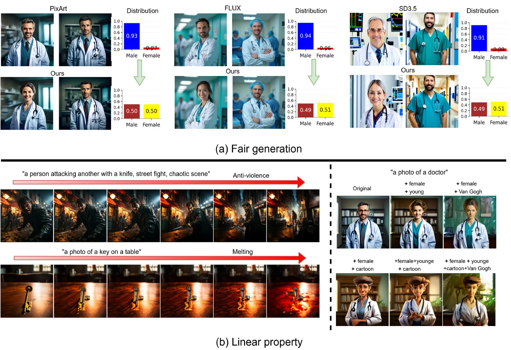

# Responsible Text-to-Image Diffusion: Interpretable and Linearly Controllable Semantics for Fair and Safe Generation

[]()
[](LICENSE)
[](https://www.python.org/)
[](https://colab.research.google.com/github/Moslem-Sh21/responsible-t2i-diffusion/blob/main/notebooks/pixart_external_heads_demo.ipynb)

**Authors:**
[Sayedmoslem Shokrolahi](https://openreview.net/profile?id=~Sayedmoslem_Shokrolahi1),
[Jae-Mo Kang](https://openreview.net/profile?id=~Jae-Mo_Kang1),
[Il-Min Kim](https://openreview.net/profile?id=~Il-Min_Kim1)

**Venue:** International Conference on Machine Learning (ICML), 2026

---

<p align="center">
  
</p>

<p align="center"><em>
(a) Fair generation: equalizing male/female distributions for the prompt "a photo of a doctor" across three modern T2I diffusion backbones (PixArt-α, FLUX, SD3.5) without retraining.
(b) Linear property: scaling and combining learned concept directions (anti-violence, melting, gender, age, style) yields predictable, compositional control.
</em></p>

---

## Overview

Modern text-to-image (T2I) diffusion models routinely amplify demographic and safety-relevant biases — generating overwhelmingly male doctors, exclusively young CEOs, and unsafe imagery for adversarial prompts. Prior work showed that, for U-Net backbones, semantically meaningful directions can be discovered in the bottleneck (h-space) and used as **linear, interpretable controls** over generation. But ViT-based diffusion models like PixArt-α, FLUX, and SD3.5 — the current state of the art — have no equivalent bottleneck, and analogous controls were not previously available.

This work closes that gap. We identify the **multi-modal cross-attention (MCA) heads** of ViT-based diffusion models as a *linear semantic locus* (LSL) — a place inside the network where added concept vectors compose **exactly linearly at the locus** and **near-linearly at the output**. We prove this with two theorems, support it empirically, and use it as the foundation of an architecture-agnostic framework that works across both U-Net (SDXL) and ViT (PixArt, FLUX, SD3.5) backbones.

### Contributions

- **Architecture-agnostic concept learning.** Single framework injects learned concept vectors at the U-Net bottleneck *or* the ViT MCA heads, with the model otherwise frozen.
- **Theoretical foundation.** Theorem 1 establishes exact linearity of multi-concept injection at the MCA block output; Theorem 2 establishes near-linearity at the model output (homogeneity and additivity to leading order).
- **Concept-alignment loss.** Replaces the standard reconstruction loss with an image-level alignment objective that suppresses spurious correlations (e.g., a "female" vector that no longer drags "young" along with it).
- **Top-K head + layer selection.** A gradient-based importance metric identifies a small subset of MCA heads (≈5 per layer) and a contiguous range of layers that carry most of the controllable signal — keeping interventions cheap and surgical.
- **State-of-the-art fairness and safety** on WinoBias and I2P across SDXL, SD3.5, PixArt, and FLUX, with no measurable degradation in CLIP score, FID, or aesthetic quality.

---

## What's in this repository

This release contains **training and inference code for two ViT-based backbones — PixArt-α and FLUX.1-dev** — together with a self-contained Colab demo for four PixArt concepts (cartoon, Van Gogh, male, female). Code and pretrained checkpoints for SD3.5 and SDXL will follow.

| Backbone   | Training | Inference | Pretrained checkpoints | Colab demo |
|------------|:--------:|:---------:|:----------------------:|:----------:|
| PixArt-α   | ✅       | ✅        | ✅ (4 concepts)        | ✅          |
| FLUX.1-dev | ✅       | ✅        | coming soon            | coming soon |
| SD3.5      | coming soon | coming soon | coming soon       | coming soon |
| SDXL       | coming soon | coming soon | coming soon       | coming soon |

```
responsible-t2i-diffusion/
├── README.md                              ← top-level overview (you are here)
├── LICENSE
├── requirements.txt
├── .gitignore
├── assets/
│   └── teaser.jpg
├── pixart/                                ← PixArt-α pipeline
│   ├── README.md
│   ├── data_generation.py
│   ├── train.py
│   ├── inference.py
│   └── utils_data.py
├── flux/                                  ← FLUX.1-dev pipeline
│   ├── README.md
│   ├── data_generation.py
│   ├── train.py
│   ├── inference.py
│   └── utils_data.py
├── notebooks/
│   └── pixart_external_heads_demo.ipynb   ← 4-concept Colab demo
└── checkpoints/
    └── README.md                          ← Hugging Face Hub download instructions
```

Each backbone folder has its own README with the local quickstart for training/inference. The top-level README focuses on the paper, the method, and pretrained-checkpoint usage.

---

## Quickstart — Colab demo

The fastest path to a working result is the Colab notebook:

[](https://colab.research.google.com/github/Moslem-Sh21/responsible-t2i-diffusion/blob/main/notebooks/pixart_external_heads_demo.ipynb)

The notebook downloads the four concept checkpoints from Hugging Face Hub (≈315 MB each), loads PixArt-α once, and produces a baseline-vs-concept side-by-side comparison for each of the four concepts. Each concept has its own coefficient that you can tune from the config cell.

| Concept   | Prompt used in the demo                                                                                                                                                            |
|-----------|------------------------------------------------------------------------------------------------------------------------------------------------------------------------------------|
| Cartoon   | *"A detailed illustration of a panda in a zoo setting, surrounded by bamboo, rocks, and soft greenery, with bold outlines, cel-shaded surfaces, expressive eyes."*                 |
| Van Gogh  | *"people walking along a riverside path with colorful trees"*                                                                                                                       |
| Male      | *"a photo of a nurse in the hospital"*                                                                                                                                              |
| Female    | *"a photo of a doctor in the hospital"*                                                                                                                                             |

---

## Local installation

```bash
git clone https://github.com/Moslem-Sh21/responsible-t2i-diffusion.git
cd responsible-t2i-diffusion
pip install -r requirements.txt
```

Tested with Python 3.10+, PyTorch 2.0+, and a single GPU with at least 16 GB VRAM for PixArt-α inference at 1024×1024 (an A100 / H100 is comfortable; a Colab T4 in fp16 also works). All paper experiments were run on an NVIDIA H100 with 80 GB.

---

## Pretrained checkpoints

The four PixArt-α concept checkpoints (≈315 MB each) are hosted on Hugging Face Hub. See [`checkpoints/README.md`](checkpoints/README.md) for download instructions. The notebook handles this automatically.

| Checkpoint                       | Concept             | Notes                          |
|----------------------------------|---------------------|--------------------------------|
| `external_concept_cartoon.pt`    | Cartoon style       | Cel-shaded illustration look   |
| `external_concept_van_gogh.pt`   | Van Gogh style      | Post-impressionist brushwork   |
| `external_concept_male.pt`       | Male attribute      | Use to balance gendered occupations |
| `external_concept_female.pt`     | Female attribute    | Use to balance gendered occupations |

---

## Method at a glance

For a ViT-based diffusion transformer, each MCA layer has H heads that each write a per-token output of dimension `d_head`. We attach a learnable vector `H_{l,h} ∈ R^{d_head}` to head `h` in layer `l` and add it (token-uniformly) to the head output before the layer's output projection `W_O^{l,h}`. Two properties drop out of this design:

1. **Exact linearity at the MCA block output.** Multiple injected concepts combine as a simple sum through the fixed projections — no cross-head interaction terms (Theorem 1).
2. **Near-linearity at the model output.** Scaling and additive composition behave linearly to leading order, with deviations bounded by the model's local second-order behavior (Theorem 2).

These vectors are trained with a **concept-alignment loss** that aligns the noise prediction of a model conditioned on a target-removed prompt Γ (e.g., *"a person"*) plus the concept vector, against a frozen copy conditioned on the target-included prompt Φ (*"a female person"*). Image-level supervision means the prompt Γ acts only as a weak scaffold — the vector ends up encoding the *visual* attribute direction, not the textual one.

A gradient-importance metric ranks MCA heads after training; the demo uses the top three heads (10, 12, 14) at layers 11–27, the configuration that gave best fairness/CLIP trade-off in the paper.

For full theory, training procedure, and ablations, see the paper.

---

## Citation

```bibtex
@inproceedings{shokrolahi2026responsible,
  title     = {Responsible Text-to-Image Diffusion: Interpretable and Linearly Controllable Semantics for Fair and Safe Generation},
  author    = {Shokrolahi, Sayedmoslem and Kang, Jae-Mo and Kim, Il-Min},
  booktitle = {International Conference on Machine Learning (ICML)},
  year      = {2026}
}
```

---

## License

MIT — see [LICENSE](LICENSE).

## Acknowledgments

Built on top of [PixArt-α](https://huggingface.co/PixArt-alpha/PixArt-XL-2-1024-MS) and the [Hugging Face `diffusers`](https://github.com/huggingface/diffusers) library.
